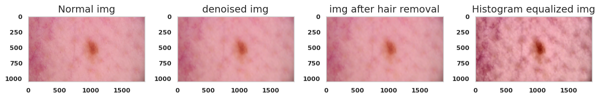
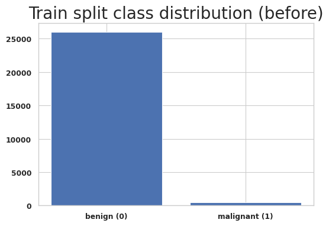
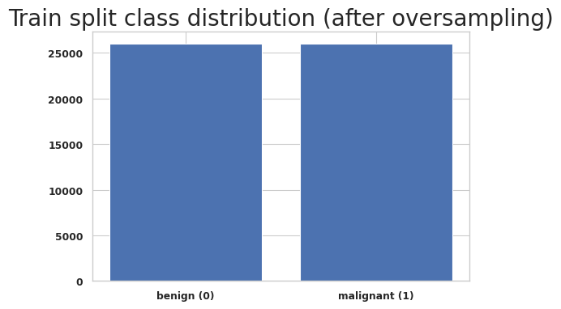
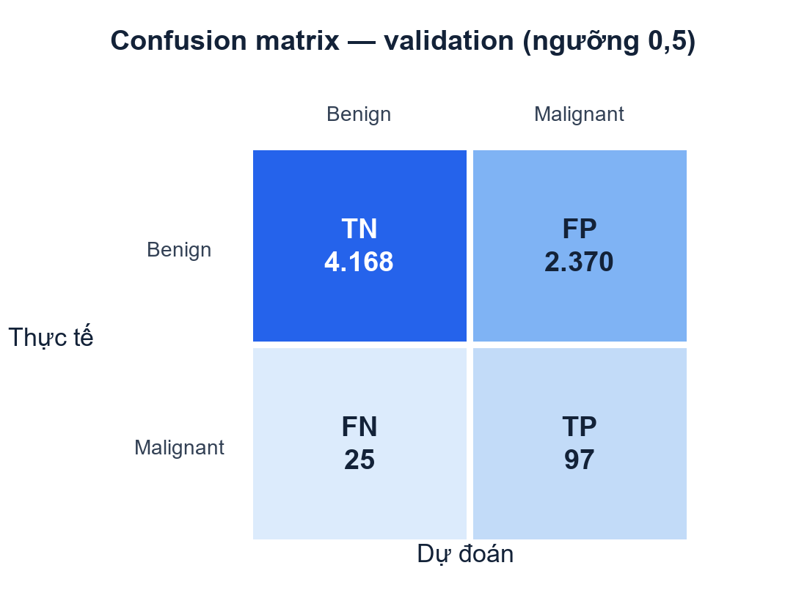
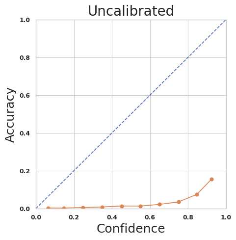
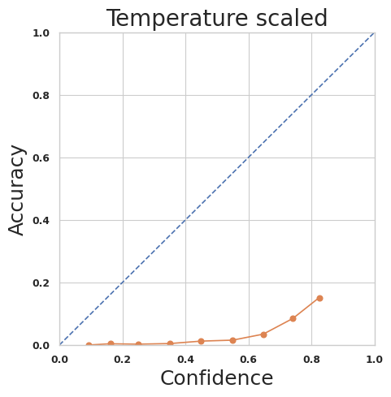

# Phân loại u hắc tố da với ước lượng độ bất định và hiệu chỉnh xác suất

Repo này trình bày quy trình nghiên cứu phân loại **melanoma (u hắc tố)** từ ảnh dermoscopy trên bộ dữ liệu SIIM-ISIC 2020. Mô hình nền là MobileNetV2; quy trình có tiền xử lý ảnh, chia dữ liệu theo bệnh nhân, xử lý mất cân bằng lớp và đánh giá cả khả năng phân loại lẫn chất lượng xác suất dự đoán.

> **Lưu ý:** Đây là dự án nghiên cứu/học thuật, không phải thiết bị y tế và không được dùng để chẩn đoán hoặc thay thế bác sĩ.

## Trạng thái công trình

Bản thảo **“An Uncertainty-Aware and Calibration-Driven Framework for Robust Melanoma Classification in Dermoscopic Imaging”** đã nhận quyết định chấp nhận trình bày tại **2026 IEEE International Symposium on Medical Measurements and Applications (MeMeA 2026)** 

Do lịch trình của nhóm, nhóm chủ động không hoàn tất đăng ký hội nghị. Vì vậy, công trình **không được trình bày, không xuất bản trong kỷ yếu/IEEE Xplore và không có DOI**.
## Bài toán và dữ liệu

- Dữ liệu: [SIIM-ISIC Melanoma Classification 2020](https://www.kaggle.com/competitions/siim-isic-melanoma-classification)
- Quy mô metadata đã sử dụng: **33.126 ảnh**, gồm **584 ảnh malignant** và **32.542 ảnh benign**.
- Dữ liệu được chia train/validation **theo bệnh nhân**, giúp giảm rò rỉ thông tin giữa hai tập.
- Dataset ảnh không được lưu trong repo do dung lượng lớn và điều khoản sử dụng dữ liệu.

## Quy trình thực nghiệm

```text
Ảnh dermoscopy + metadata
        ↓
Làm sạch metadata và phân tích phân bố lớp
        ↓
Tiền xử lý ảnh
(khử nhiễu → phát hiện/loại tóc → CLAHE → resize/normalize)
        ↓
Chia train/validation theo patient_id
        ↓
Oversampling lớp malignant trên tập train
        ↓
MobileNetV2 transfer learning
(warm-up → fine-tuning)
        ↓
Đánh giá ROC-AUC, PR-AUC, confusion matrix
        ↓
Temperature scaling và phân tích calibration
```

### Minh họa tiền xử lý



### Xử lý mất cân bằng lớp

| Trước oversampling | Sau oversampling |
|---|---|
|  |  |

## Kết quả chính

Các số liệu dưới đây lấy từ lần chạy được lưu trong notebook nghiên cứu gốc. Ngưỡng phân loại là **0,5**.

| Chỉ số | Giá trị |
|---|---:|
| ROC-AUC | 0,8019 |
| PR-AUC | 0,0897 |
| Accuracy | 0,6404 |
| Sensitivity / Recall lớp malignant | 0,7951 |
| Specificity | 0,6375 |
| Precision lớp malignant | 0,0393 |
| F1 lớp malignant | 0,0749 |

Confusion matrix trên tập validation:

|  | Dự đoán benign | Dự đoán malignant |
|---|---:|---:|
| **Thực tế benign** | TN = 4.168 | FP = 2.370 |
| **Thực tế malignant** | FN = 25 | TP = 97 |



Do lớp malignant rất hiếm, accuracy hoặc ROC-AUC riêng lẻ chưa phản ánh đầy đủ chất lượng hệ thống. Recall malignant tương đối cao nhưng precision thấp, đồng nghĩa mô hình tạo nhiều cảnh báo dương tính giả. Trong bối cảnh thực tế, đây là chi phí sàng lọc cần được đánh giá cùng bác sĩ và ngưỡng vận hành phù hợp.

## Kết quả hiệu chỉnh xác suất

| Chỉ số | Trước hiệu chỉnh | Sau temperature scaling |
|---|---:|---:|
| Brier score ↓ | 0,2251 | **0,2136** |
| ECE ↓ | **0,3850** | 0,4119 |
| Nhiệt độ tối ưu | — | 1,7135 |

Temperature scaling làm **Brier score tốt hơn nhưng ECE xấu hơn** trong lần chạy này. Vì vậy, repo không khẳng định calibration đã được cải thiện đồng đều; kết quả cho thấy cần đánh giá thêm theo nhiều binning scheme, nhiều seed và external validation.

| Trước hiệu chỉnh | Sau temperature scaling |
|---|---|
|  |  |

Phần MC Dropout/ước lượng độ bất định trong nghiên cứu ban đầu chưa có kết quả chạy hoàn chỉnh được lưu lại, nên không được báo cáo như một kết quả đã xác nhận trong repo này.

## Cấu trúc repo

```text
melanoma-classification-research/
├── assets/                         # Hình minh họa và biểu đồ kết quả
├── notebooks/
│   └── melanoma_classification_clean.ipynb
├── results/
│   └── metrics.json                # Số liệu của lần chạy đã báo cáo
├── src/
│   ├── evaluation.py               # Metrics và calibration
│   └── preprocessing.py            # Tiền xử lý ảnh dermoscopy
├── .env.example
├── .gitignore
├── README.md
└── requirements.txt
```

## Cách chạy

### 1. Tạo môi trường

```bash
python -m venv .venv
```

Kích hoạt môi trường và cài thư viện:

```bash
pip install -r requirements.txt
```

### 2. Chuẩn bị dữ liệu

Tải dataset từ Kaggle, sau đó đặt biến môi trường `SIIM_ISIC_DATA_DIR` trỏ tới thư mục chứa `train.csv` và `jpeg/train/`.

Ví dụ trên Windows PowerShell:

```powershell
$env:SIIM_ISIC_DATA_DIR = "D:\data\siim-isic-melanoma-classification"
jupyter notebook notebooks/melanoma_classification_clean.ipynb
```

Trên Kaggle, notebook tự dùng đường dẫn mặc định của cuộc thi nếu biến môi trường chưa được đặt.

## Khả năng tái lập và giới hạn

- Repo không chứa dữ liệu gốc, model checkpoint hoặc thông tin xác thực Kaggle.
- Notebook sạch đã bỏ output cũ và các cell thử nghiệm trùng lặp; cần chạy lại để tái tạo kết quả trong môi trường mới.
- Kết quả hiện tại đến từ một lần chia dữ liệu; chưa có cross-validation hoặc external validation.
- Oversampling có thể làm thay đổi phân bố xác suất và cần được cân nhắc khi calibration.
- Hệ thống chỉ hỗ trợ nghiên cứu; mọi quyết định lâm sàng cần có chuyên gia y tế.

## Nhóm thực hiện

- Trương Việt Anh
- Nguyễn Mạnh Tuấn
- Vũ Đình Thư 
- Đặng Văn Hiếu

